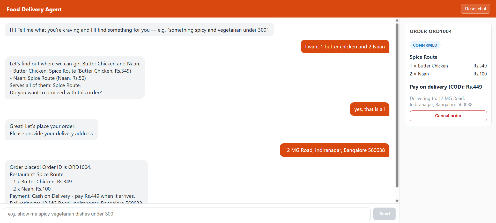
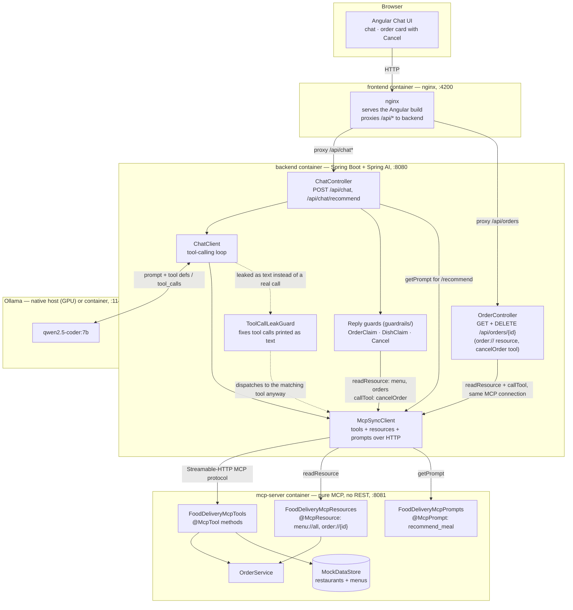

# Food Delivery Agent POC

A proof of concept exploring **Spring Boot + agentic AI**: an Angular chat UI
talks to a Spring Boot backend, which uses **Spring AI**'s tool-calling
ChatClient to let a **locally-running Ollama model** act as a food-ordering
agent — searching restaurants, filtering dishes by preference, taking a
delivery address, placing Cash on Delivery orders, and checking delivery
status.



*Ordering through chat: the agent checks the menu, asks for a delivery address,
then places a Cash on Delivery order. The card on the right is live and can be
cancelled while the order is still being prepared.*

The tools themselves live in a separate **MCP server** (`mcp-server/`),
exposed over the Model Context Protocol using Spring AI's annotations —
`@McpTool` for actions, `@McpResource` for readable state, and `@McpPrompt`
for a reusable prompt template. `mcp-server` is *pure* MCP: no REST
controllers, no UI-specific endpoints, just the three MCP primitives. The
backend is an MCP *client*: it discovers the tools at startup over HTTP and
hands them to the `ChatClient` so the model decides for itself which to
call, and it reads the resources to power its own thin REST API for the UI.
This mirrors how you'd integrate a real third-party MCP server (like the one
[Swiggy publishes](https://github.com/Swiggy/swiggy-mcp-server-manifest) for
consumer AI clients) instead of wiring tool implementations directly into
the agent process.

There's no real Zomato/Swiggy integration: both platforms gate their APIs
behind formal partner onboarding (business verification, legal agreements)
with no public self-serve sandbox, and their APIs are designed for
restaurants' POS systems to *receive* orders, not for a third-party app to
*place* orders on a customer's behalf. So the restaurant catalog and order
fulfillment are mocked in the backend, while everything else — the HTTP
stack, the LLM tool-calling loop, the ordering logic — is real.

## Architecture



- **`frontend/`** — Angular 18 chat UI with a live order-status card.
- **`mcp-server/`** — Spring Boot 4 + Spring AI 2 MCP server, and *pure*
  MCP: no REST controllers, nothing UI-specific. Three annotation-driven
  primitives, all served over Streamable-HTTP MCP (`/mcp`):
  - `FoodDeliveryMcpTools` — `@McpTool` actions: `searchRestaurants`,
    `getMenu`, `searchDishes`, `findDishByName` (which restaurants serve
    specific dishes, and which dishes aren't on any menu), `placeOrder`
    (restaurant + dishes + delivery address, Cash on Delivery),
    `cancelOrder` (allowed until the order is out for delivery), and
    `checkOrderStatus`. There is no cart: the agent agrees the food with
    you, asks for an address, then places the order in one call.
  - `FoodDeliveryMcpResources` — `@McpResource` readable state:
    `menu://all` (every dish and price, used by the backend to fact-check
    replies) and `order://{orderId}` (items, total, address, COD and live
    status incl. `CANCELLED`), both returning JSON. This is how the UI's
    order card gets live data without a bolted-on REST API.
  - `FoodDeliveryMcpPrompts` — `@McpPrompt` reusable template:
    `recommend_meal`, pre-filled with a caller-supplied preference.

  Owns all domain state: a mock in-memory restaurant/menu catalog (4
  restaurants, 17 dishes) and orders. Order status progresses
  automatically (confirmed → preparing → out for delivery → delivered) over
  ~70 seconds after placing an order, simulating delivery without a real
  logistics integration.
- **`backend/`** — Spring Boot 4 + Spring AI 2 MCP *client* and chat agent.
  It discovers `mcp-server`'s tools at startup and wires them into the
  `ChatClient`. Its `OrderController` reads the `order://{id}` MCP resource
  (over the same connection, not a separate HTTP call) and republishes it
  as plain REST for the UI (404 if the order doesn't exist); its
  `DELETE /api/orders/{id}` calls the `cancelOrder` MCP tool. `ChatController`
  hands every reply to the `guardrails` package (see Guardrails) and exposes
  `/api/chat/recommend`, which fetches the `recommend_meal` prompt and feeds
  it to the agent — a working example of consuming an MCP prompt, not just
  tools.
- **`docker-compose.yml`** — orchestrates the whole stack (`mcp-server`,
  `backend`, `frontend`), or just those three if you already have Ollama
  running natively.

## Prerequisites

You need **one** of these two setups.

### Option A — Docker (easiest)

- [Docker Desktop](https://www.docker.com/products/docker-desktop/) (with Compose v2, bundled by default)
- [Ollama](https://ollama.com/download) installed and running **natively on your host** — the compose setup talks to it via `host.docker.internal` so it can use your GPU. (A fully containerized Ollama is also available; see [Containerized Ollama](#containerized-ollama-instead-of-host-ollama) below, but it runs CPU-only unless you configure GPU passthrough yourself.)

### Option B — Fully manual (no Docker)

- Java 17+
- Maven (or use the included `./mvnw` wrapper — no local Maven install needed)
- Node.js 20+ and npm
- [Ollama](https://ollama.com/download) installed and running

## First-time setup

1. Install and start Ollama (see [ollama.com/download](https://ollama.com/download) — on Windows/Mac it runs as a background app after install; on Linux, `ollama serve`).
2. Pull a tool-calling-capable model. This project defaults to `qwen2.5-coder:7b` (7B params, ~4.7GB download):
   ```bash
   ollama pull qwen2.5-coder:7b
   ```
   `llama3.2` (3B, faster, ~2GB) also works and is much lighter, but is noticeably less reliable about only mentioning real menu items instead of inventing plausible-sounding ones — see [Known limitations](#known-limitations).
3. Verify Ollama is reachable:
   ```bash
   curl http://localhost:11434/api/version
   ```

## Running it

### Option A — Docker Compose

From the project root:

```bash
docker compose up --build
```

This builds and starts:
1. `mcp-server` — Spring Boot MCP server exposing the food-delivery tools over Streamable-HTTP MCP
2. `backend` — Spring Boot, connecting to your host's Ollama at `http://host.docker.internal:11434` and to `mcp-server` at `http://mcp-server:8081`
3. `frontend` — the Angular app built and served by nginx, which proxies `/api/*` to the backend

Open **http://localhost:4200**.

To use a different model, set `OLLAMA_MODEL` before starting (must already be pulled):

```bash
OLLAMA_MODEL=llama3.2 docker compose up --build
```

To stop: `docker compose down`.

#### Containerized Ollama instead of host Ollama

If you'd rather not install Ollama natively, a containerized copy is
available behind a Compose profile. It runs CPU-only by default (noticeably
slower than a native install with GPU access) and needs its own model pull
into the container's volume:

```bash
OLLAMA_BASE_URL=http://ollama:11434 docker compose --profile containerized-ollama up --build
```

### Option B — Fully manual, no Docker

Three terminals, from the project root:

```bash
# Terminal 1 — MCP server (http://localhost:8081)
cd mcp-server
./mvnw spring-boot:run
```

```bash
# Terminal 2 — backend (http://localhost:8080), talks to mcp-server on localhost:8081
cd backend
./mvnw spring-boot:run
```

```bash
# Terminal 3 — frontend (http://localhost:4200)
cd frontend
npm install
npm start
```

`npm start` runs `ng serve` with a dev proxy (`proxy.conf.json`) that
forwards `/api/*` requests to `localhost:8080`, so the Angular app works
exactly like the Docker version without needing nginx.

Open **http://localhost:4200**.

To use a different model, set `OLLAMA_MODEL` as an environment variable
before starting the backend, e.g. `OLLAMA_MODEL=llama3.2 ./mvnw spring-boot:run`.

## Trying it out

Type things like:
- "Show me spicy vegetarian dishes under 300"
- "What's on the menu at Pizza Bella?"
- "Which restaurant serves Paneer Tikka and Dal Makhani?"
- "I'll take 2 Paneer Tikka from Spice Route" → the agent asks for a delivery
  address → give one → it places a Cash on Delivery order and tells you the
  order ID and the amount to pay
- "What's the status of order ORD1001?"
- "Please cancel order ORD1001" — or press **Cancel order** on the order card
  (works until the order is out for delivery, roughly the first 40 seconds)

Once an order is placed, its status card (items, cash to pay, address, live
delivery status, and a Cancel button while it can still be cancelled)
appears in the sidebar, independent of the chat — it comes from `backend`
reading `mcp-server`'s `order://{id}` MCP resource.

You can also try the `recommend_meal` MCP prompt directly:

```bash
curl -X POST http://localhost:8080/api/chat/recommend \
  -H "Content-Type: application/json" \
  -d '{"preference": "vegetarian and spicy"}'
```

## API reference

All served by `backend` (port 8080). `mcp-server` (port 8081) has no REST
API of its own — everything it exposes is MCP tools, resources, and
prompts; `backend` is what turns some of that into plain REST for the UI.

| Method | Path | Purpose |
|---|---|---|
| `POST` | `/api/chat` | Send a chat message (`{"message": "..."}`), get the agent's reply |
| `POST` | `/api/chat/recommend` | Fetch the `recommend_meal` MCP prompt (`{"preference": "..."}`) and send it to the agent |
| `DELETE` | `/api/chat` | Reset the conversation history |
| `DELETE` | `/api/orders/{id}` | Cancel an order (calls the `cancelOrder` MCP tool); 409 if it's too late or unknown |
| `GET` | `/api/orders/{id}` | One order's items, total, and live-computed status (reads the `order://{id}` MCP resource; 404 if unknown) |

## Guardrails

A small local model will announce orders it never placed, invent dishes and
prices, and claim cancellations it never made. So nothing the model says is
taken on trust: three layers check it against the real system.

| Layer | Where | Example |
|---|---|---|
| 1. Prompt rules | [`ChatClientConfig`](backend/src/main/java/com/poc/fooddelivery/config/ChatClientConfig.java) | "look up named dishes first", "never claim an order without calling `placeOrder`" |
| 2. Tool-side validation | `mcp-server` — `placeOrder`, `OrderService.cancel` | `placeOrder` refuses without an address or with a dish that isn't on the menu; cancelling is refused once the order is out for delivery |
| 3. Reply guards | [`backend/.../guardrails/`](backend/src/main/java/com/poc/fooddelivery/guardrails) | below |

The reply guards all live in one package and run in order from
`GuardrailChain`:

| Guard | Catches | What it does |
|---|---|---|
| `ToolCallLeakGuard` | a tool call printed as text (`{"name":"placeOrder",...}`), or raw MCP JSON (`[{"text":...}]`) echoed back | runs the intended tool itself and unwraps the result, per line |
| `OrderClaimGuard` | "Order placed! ORD1001" when no such order exists, or an old/cancelled ID reused | the ID must be one the customer mentioned or one created this turn; otherwise retries once, then tells the customer nothing was ordered, with the tool's real reason |
| `DishClaimGuard` | a dish that isn't on any menu, or a wrong price ("Naan: Rs.120") | checks against the real menu (`menu://all`) and replaces the reply with a plain correction that lists what *is* available |
| `CancelGuard` | "Order cancelled" without the tool being called | if the order isn't really `CANCELLED`, calls the `cancelOrder` MCP tool itself and reports its real answer |

Support classes in `guardrails/support/`: `ToolResultLog` and
`RecordingToolCallback` remember what each tool really returned (so a refusal
reason can reach the customer), and `OrderGateway` is how the guards read and
cancel orders on `mcp-server`. `ChatController` only calls the model and hands
the reply to the chain.

These are heuristics over the reply text, not a guarantee: they catch invented
dishes, prices, order IDs and cancellations, but not every possible false
statement.

## Known limitations

This is a POC, and a couple of its rough edges are genuinely instructive
about the current state of local-model agentic tooling, not just bugs to
paper over:

- **Small/quantized local models are not fully reliable at structured tool
  calling.** Occasionally a model emits its intended tool call as plain text
  (e.g. `{"name": "searchDishes", "arguments": {...}}`) instead of using
  Ollama's structured `tool_calls` response field. Spring AI never sees that
  as a real tool invocation, so without a safeguard the model would be left
  to improvise an answer with no real data — which is exactly what caused it
  to invent fictional restaurants/dishes during testing. `ToolCallLeakGuard`
  detects this exact leak and dispatches it to the matching `ToolCallback`
  (an MCP tool here, but the same fix works for local `@Tool` methods too).
  A second, related quirk showed up only over MCP: since an MCP tool's
  result is a structured content-block list (not a plain string), a model
  that echoes it verbatim produces raw `[{"text":"..."}]` JSON instead of
  prose — and because dispatching a leaked call *itself* returns that raw
  structure, the cleanup has to run in a **pipeline** (dispatch, then
  unwrap whatever came out of dispatch), not as two independent
  alternatives — an easy bug to reintroduce if this code gets refactored. A
  third variant: asked to do two things in one turn (e.g. "check order
  ORD1001 and cancel it"), the model sometimes leaks *two* tool calls as
  separate JSON objects, one per line, rather than one — so the cleanup runs
  per-line, dispatching and unwrapping each independently and rejoining
  them, instead of treating the whole reply as a single JSON document.
  The backend runs every reply through it first, so results stay accurate
  and in plain text even when a model's output format slips.
- **The model sometimes claims actions it never took**, so the backend
  verifies the claims that matter (orders, dishes and prices, cancellations)
  instead of trusting the reply. See [Guardrails](#guardrails).
- **Smaller models (e.g. `llama3.2`, 3B) hallucinate more under pressure.**
  Asking for something that doesn't exist in the mock menu (e.g. "spicy
  pizza" — no pizza in the catalog is marked spicy) can cause a small model
  to relabel or invent a dish rather than plainly saying there's no match.
  `qwen2.5-coder:7b` is noticeably more reliable about this; the system
  prompt (`ChatClientConfig`) also explicitly instructs against it, but
  prompt instructions alone don't fully fix it on a 3B model.
- **Single global conversation.** There's no per-user session —
  orders and chat history are shared app-wide in memory (orders reset when
  `mcp-server` restarts, chat history when `backend` does). Fine for a solo local demo, not for multiple
  simultaneous users.
- **nginx and container restarts.** By default nginx resolves the `backend`
  hostname once and keeps that IP, so recreating the backend container would
  leave it pointing at a dead address (502s). `nginx.conf` re-resolves it
  through Docker's DNS (`127.0.0.11`) on every request, and serves the page
  with `Cache-Control: no-cache` so a rebuilt UI shows up on a normal refresh.
- **`backend`'s MCP connection to `mcp-server` doesn't auto-reconnect.** The
  MCP client connection is established once at `backend`'s own startup, so
  if you restart or rebuild `mcp-server` on its own, `backend` keeps trying
  to reach the now-dead old instance until it's restarted too. Restart both
  together: `docker compose restart mcp-server backend`, or rebuild the
  whole stack with `docker compose up -d --build`.
